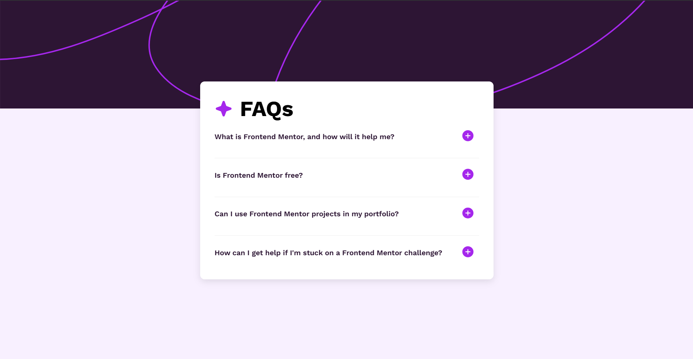

# Frontend Mentor - FAQ accordion Solution [[Live Here](https://browser-extension-manager-ui.vercel.app/)]

This is a solution to the [FAQ accordion challenge on Frontend Mentor](https://www.frontendmentor.io/challenges/faq-accordion-wyfFdeBwBz).

## Overview

### Screenshot

### Links

- Solution URL: []
- Live Site URL: []

### Built with

- Semantic HTML5 markup
- CSS GRID
- JavaScript

### What I learned

- CSS for making accordion style layouts and responsiveness.